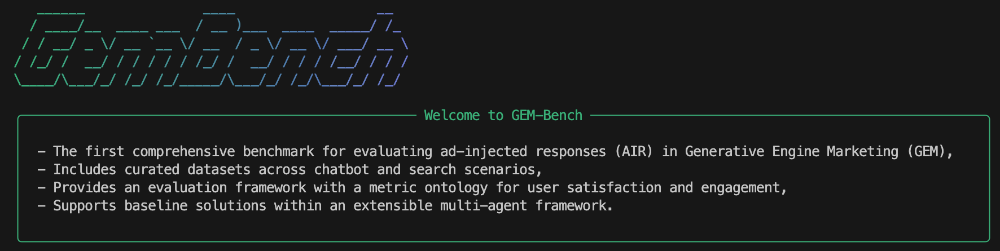

# GemBench

[](LICENSE)[](https://www.python.org/downloads/)

GemBench is a repository containing two major works:

1. **Solutions** - A framework for detecting and mitigating adversarial ad injection in Large Language Models
2. **GemBench** - A comprehensive benchmarking framework for evaluating ad injection detection techniques



## 📋 Table of Contents

- [Installation](#installation)
- [Getting Started](#getting-started)
- [License](#license)

## 🔧 Installation

### Prerequisites

- Python 3.12 or higher
- Conda (recommended for environment management)

### Setup

```bash
# Clone the repository
git clone https://github.com/AdVocate-LLM/GEM-Bench.git
cd GemBench

# Create and activate conda environment
conda create --name GemBench python=3.12
conda activate GemBench

# Install requirements
pip install -e .
```

### Environment Configuration

Create a `.env` file in the root directory with the following variables:

```
# please fill in your own API keys here and change the file name to .env
OPENAI_API_KEY="<LLms API Key>"
BASE_URL="<LLMs Base URL>"

TRANSFORMERS_OFFLINE=1 # Enable offline mode for Hugging Face Transformers
HF_HUB_OFFLINE=1 # Enable offline mode for Hugging Face Hub

# Embedding
EMBEDDING_API_KEY="<Embedding API Key>"
EMBEDDING_BASE_URL="<Embedding Base URL>"
```

## 🚀 Getting Started

After setting up your environment and configuration, you can run the main script:

```bash
python paper.py # fast to reproduct our paper
```

### Configuration Options

The `paper.py` file contains several example configurations you can uncomment and modify:

1. **AdVocate Workflow Example**: Test individual AdVocate solutions
2. **ChatBot Workflow Example**: Test ChatBot-based solutions
3. **GemBench Evaluation**: Run comprehensive benchmarking (default enabled)

To modify the evaluation, edit the `paper.py` file and adjust:

- Dataset selections (`data_sets` parameter)
- Solution configurations (`solutions` dictionary)
- Model choices (`model_name` and `judge_model` parameters)

### Available Datasets

The framework supports multiple benchmark datasets:

- `MT-Human`: MT-Bench humanities questions
- `LM-Market`: LM-Market conversation datasets
- `CA-Prod`: Notice if you give the best product selector dict it will be enable auto.


## 📄 License

This project is licensed under the MIT License - see the LICENSE file for details.
